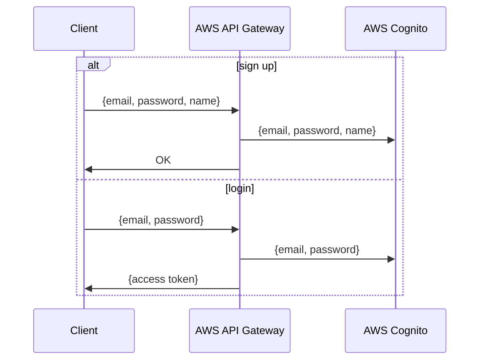

## Handling Authentication Requests

This function processes authentication-related requests, ensuring proper request validation, user verification, and response handling. It integrates with AWS API Gateway for event reception and AWS Cognito for user authentication.

#### **1. Receiving the Request**

- The function is triggered upon receiving an event containing a request body and metadata.
- If the request body is in string format, it is parsed into a structured format.
- If parsing fails, the request is rejected with an appropriate error response.

#### **2. Validating the Request**

- The function verifies that the required authentication details are provided.
- If any required fields are missing or invalid, an error response is returned.

#### **3. Processing the Authentication Flow**

Depending on the request type, the function takes one of the following actions:

#### **User Registration**

- A new user record is created in the identity management system.
- Upon successful registration, a confirmation response is sent back.

#### **User Authentication**

- The provided credentials are validated against the identity management system.
- If authentication is successful, an access credential is issued.
- This credential allows the user to authenticate future requests.

#### **4. Handling Unknown Requests**

- If the request does not match any expected authentication process, an error response is returned indicating that the requested action is not supported.

#### **5. Error Handling and Logging**

- Any unexpected errors encountered during execution are logged for debugging and monitoring.
- The response includes appropriate status codes and error messages, ensuring clarity for clients interacting with the system.

---

## Managing Authentication State

- The system does not persist user credentials directly but relies on a secure identity provider.
- Users must retain their issued authentication credentials to access protected resources.
- If authentication credentials expire, the user may need to request a new credential from the system.
